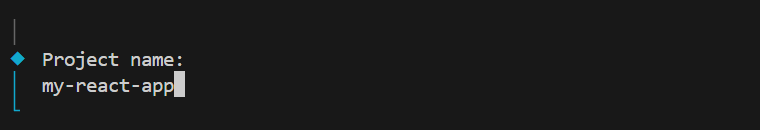
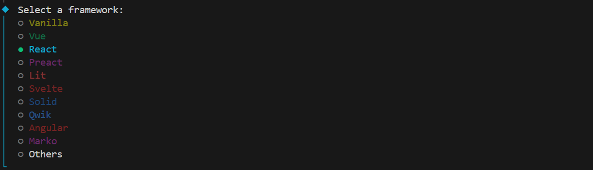
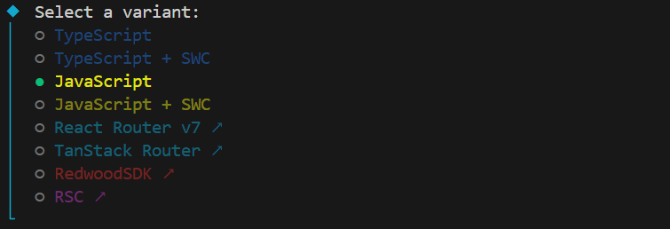

# Setting Up a React Environment

In this guide, we’ll set up a React project using **Vite** using four easy steps.

---

## Step 1: Check if Node.js is Installed

Open your terminal and type:

```bash 
node -v
```
If Node.js is installed, you’ll see a version number
```bash
v23.8.0
```

If not, download and install [Node official website](https://nodejs.org/en/download/).

💡 Installing Node.js also gives you npm (Node Package Manager), which we’ll use later.

## Step 2: Create a Vite Project
A development server is like a playground where we build and test our React app.
We’ll use Vite for this.

Run the following command in your terminal:

```bash
npm create vite@latest
```
## Step 3: Configure Vite
Vite will ask you a few questions:

Project Name → type a name for your project folder.
  


Framework → select React.


Variant → select JavaScript.

:::tip NOTE
There are two Javascript variants, but in our project we will use plain Javascript.
:::

## Step 4: Start the React Environment
Move into your project folder:

```bash
cd my-react-app
```
Install the required dependencies:

```bash
npm install
```

Then start the development server:

```bash
npm run dev
```
If successful, you’ll see something like:
```bash
  VITE v7.1.4  ready in 760 ms

  ➜  Local:   http://localhost:5173/
  ➜  Network: use --host to expose
  ➜  press h + enter to show help
```

Open the Local URL in your browser to view your React app 🎉.